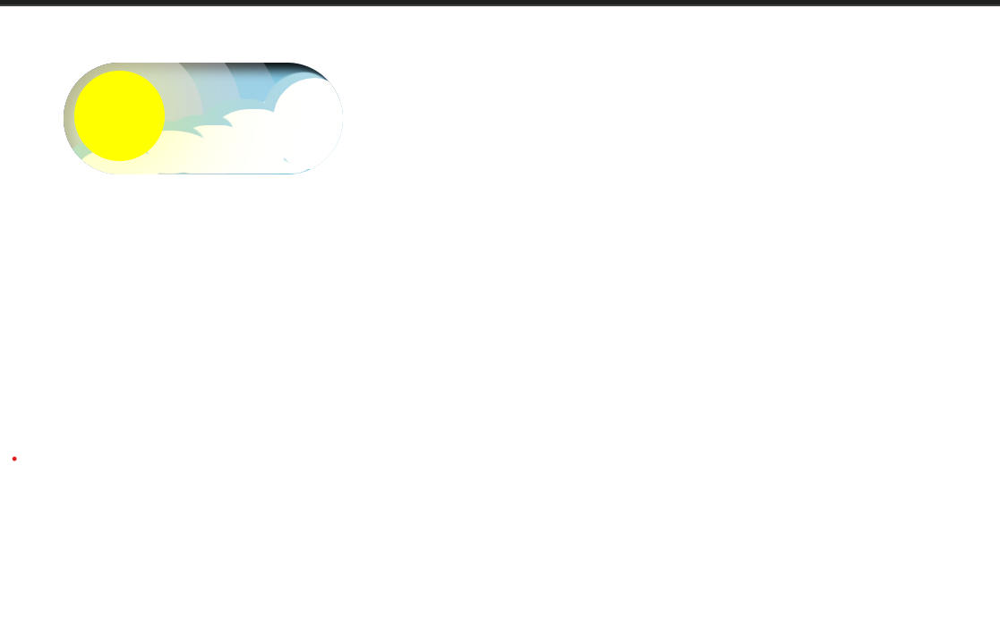
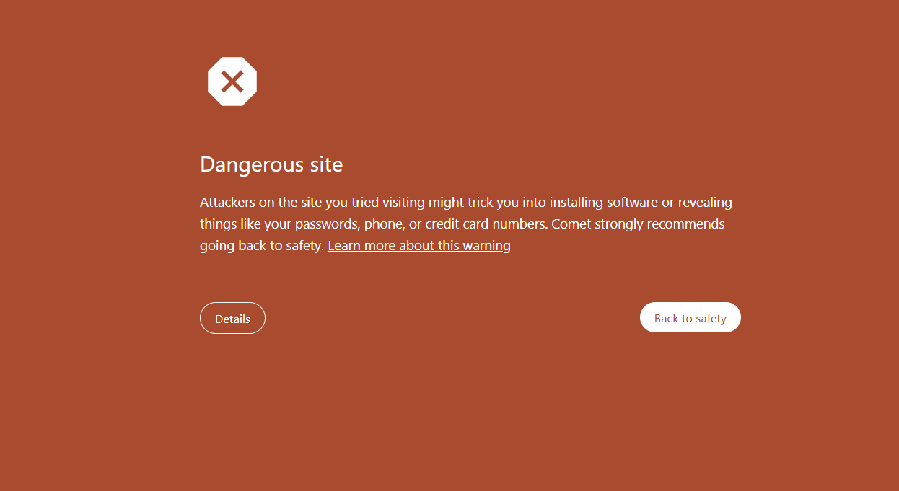
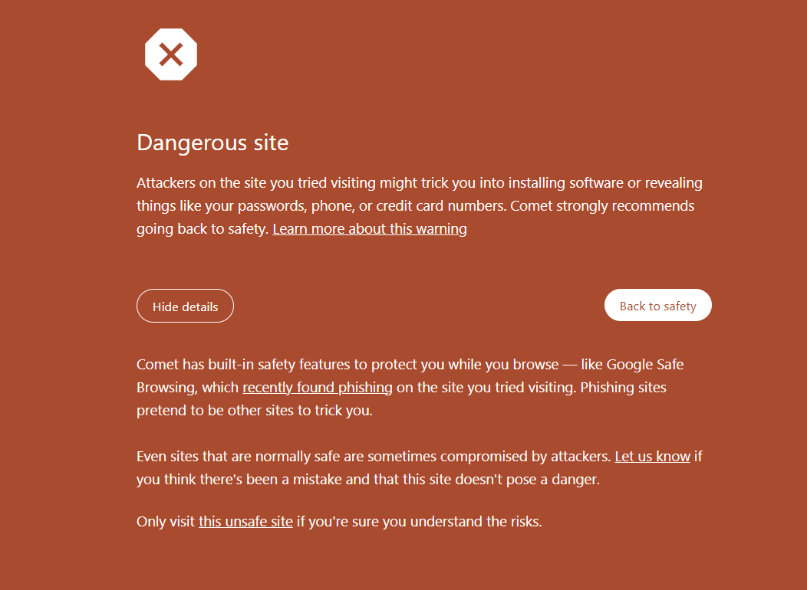

<h1>Theme with animation</h1>
<h2>A user friendly button which can change theme with animation</h2>

<h1>Light theme</h1>
</img>

<h1>Dark theme</h1>
</img>

<h1>To Try the website</h1>

<h3><a href="https://amitsingh-codes.github.io/Theme/" target="_blank">link</a></h3>

<h2>May show

</img>

<h1>Steps to solve the issue</h1>

<h3> click on Details ----> click on <u>this unsafe site</u> <h2>(Is 100% safe just not verified my chrome that is why the issue is coming)</h2></h3>

</img>